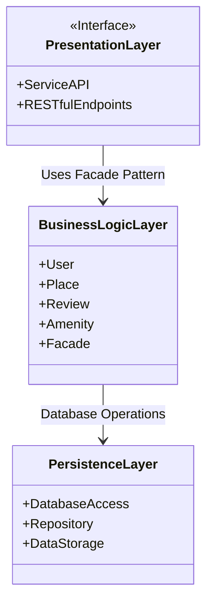
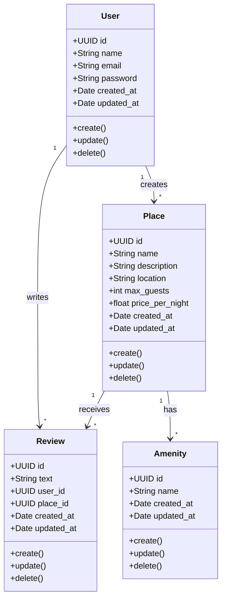
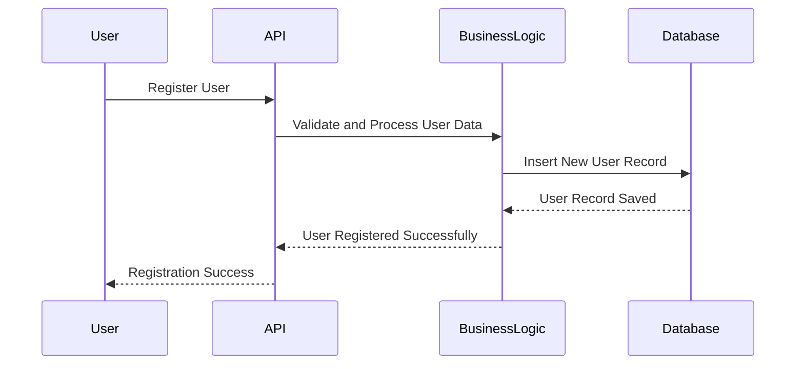
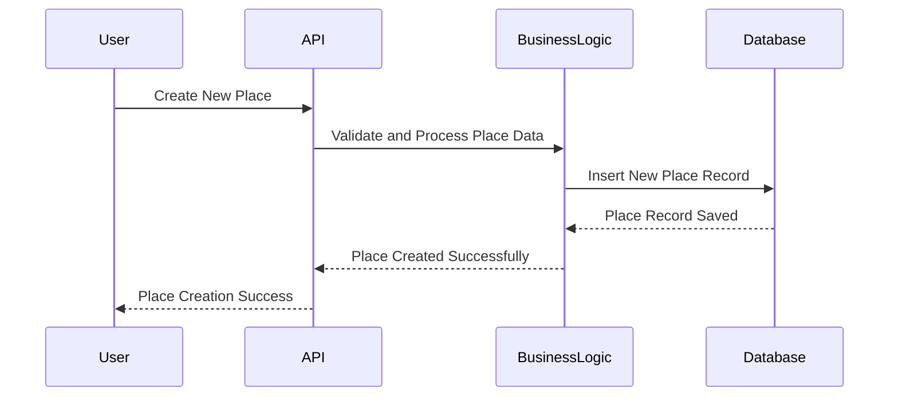
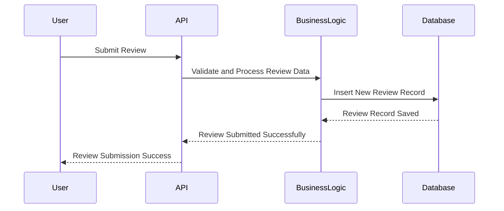
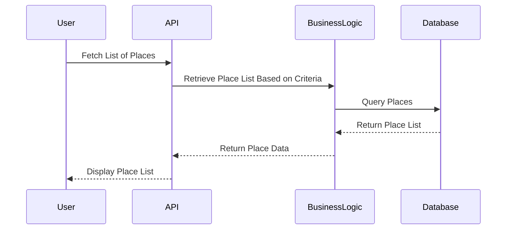

# HBnB Project Technical Documentation

## Introduction

The purpose of this document is to provide a comprehensive technical blueprint for the HBnB application. It outlines the system architecture, key components, and interactions necessary for the development and maintenance of the project. This documentation serves as a reference guide for developers during the implementation phase.

## High-Level Architecture

The HBnB application is designed using a three-layer architecture with the facade pattern to simplify interactions between layers. The three layers are:

1. Presentation Layer: Manages user interactions via services and APIs.
2. Business Logic Layer: Handles core application logic and processes.
3. Persistence Layer: Manages data storage and retrieval.

### High-Level Package Diagram

**Explanation:**

- The **Presentation Layer** interfaces with clients.
- The **Business Logic Layer** processes requests and applies business rules.
- The **Persistence Layer** provides data storage support.

## Business Logic Layer

The core of the HBnB application lies in its Business Logic Layer, which contains the primary entities:

- `User`
- `Place`
- `Review`
- `Amenity`

### Detailed Class Diagram

**Explanation:**

- **User** can create places and write reviews.
- **Place** can receive reviews and have multiple amenities.
- **Review** links users and places.
- **Amenity** represents additional features for places.

## API Interaction Flow

The interaction between layers during API calls follows a structured sequence to ensure data integrity and performance.

### 1. User Registration

**Explanation:**

- The User initiates a registration request.
- The API validates the request and delegates processing to Business Logic.
- Business Logic stores the data in the Database.

### 2. Place Creation

**Explanation:**

- User requests a new place creation.
- API forwards the request to the Business Logic Layer.
- Database stores the new Place.

### 3. Review Submission

**Explanation:**

- User submits a review.
- API validates the request and sends it to Business Logic.
- Database records the review.

### 4. Fetching a List of Places

**Explanation:**

- **User** requests available places.
- **API** asks **Business Logic** to query **Database**.
- **Database** returns the list to the client.

## Conclusion

This document provides an architectural overview of the HBnB application, detailing its layered structure, core entities, and essential API interactions. This serves as a guide for developers to implement, maintain, and extend the application effectively.

